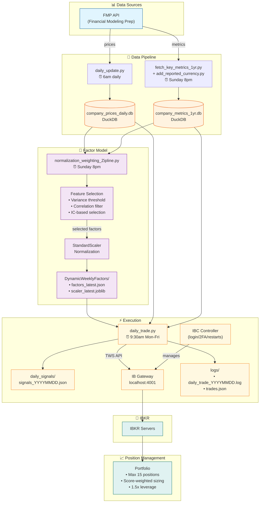

# Lodon Trading System Architecture



## Data Flow Summary

| Stage | Component | Schedule | Output |
|-------|-----------|----------|--------|
| **Source** | FMP API | - | Raw prices & metrics |
| **Data** | daily_update.py | 6am daily | company_prices_daily.db |
| **Data** | fetch_key_metrics_1yr.py + add_reported_currency.py | Sunday 8pm | company_metrics_1yr.db (with currency) |
| **Model** | normalization_weighting_Zipline.py | Sunday 8pm | factors_latest.json, scaler_latest.joblib |
| **Trade** | daily_trade.py | 9:30am Mon-Fri | Signals + orders via IB Gateway |
| **Position** | IBKR | Real-time | Portfolio updates |

## Key Files

```
/home/simon0099/Lodon/
├── FMP_Databases/
│   ├── company_prices_daily.db      # Daily OHLCV
│   ├── company_prices_daily_1yr.db  # 1-year prices
│   └── company_metrics_1yr.db       # Fundamental metrics
├── DynamicWeeklyFactors/
│   ├── factors_latest.json          # Selected factor names + directions
│   └── scaler_latest.joblib         # Fitted StandardScaler
├── daily_signals/
│   └── signals_YYYYMMDD.json        # Daily BUY/SELL signals
├── zipline-factor-backtest/
│   └── normalization_weighting_Zipline.py
├── daily_trade.py                   # Signal generation + IB execution
└── logs/
    ├── daily_trade_YYYYMMDD.log     # Execution logs
    └── trades.json                  # Trade history
```
